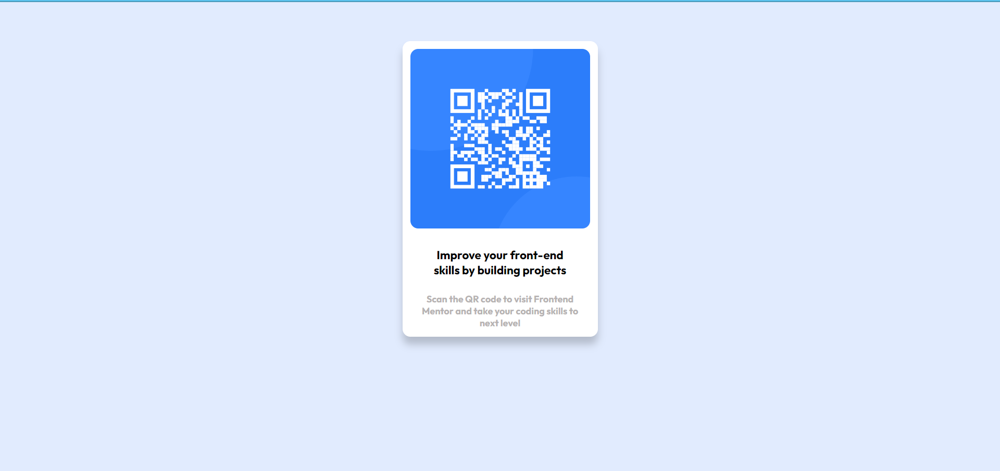

# Frontend Mentor - QR code component solution

This is a solution to the [QR code component challenge on Frontend Mentor](https://www.frontendmentor.io/challenges/qr-code-component-iux_sIO_H). Frontend Mentor challenges help you improve your coding skills by building realistic projects.

## Table of contents

- [Overview](#overview)
  - [Screenshot](#screenshot)
  - [Links](#links)
- [Author](#author)

## Overview

### Screenshot

### Links

- Solution URL: https://github.com/balvinder1009/Qr-Code-Component.git
- Live Site URL: https://balvinder1009.github.io/Qr-Code-Component/

## Author

- Frontend Mentor - (https://www.frontendmentor.io/profile/balvinder1009)
